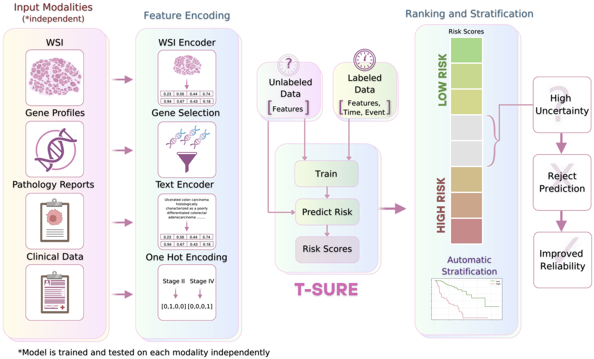

# T-SURE: Uncertainty-Aware Survival Prediction with Transductive Learning for Clinical Decision Support

**T-SURE** is a transductive survival ranking model with an integrated *rejection option* for prognosis tasks.  
It enables learning from both labeled and unlabeled samples while explicitly modeling uncertainty and abstaining from unreliable predictions.  
T-SURE is applied to multiple cancer types and modalities including whole-slide images (WSI), gene expression, pathology reports, and clinical data.



---

## Datasets

### 🔗 Download Links

- **WSI Embeddings**: Download from [Titan GitHub Repository](https://github.com/mahmoodlab/TITAN)
- **Gene Expression**: Included as Excel files inside `Datasets/TCGA_GeneExp/`
- **Report Embeddings**: Due to file size, they are hosted externally — *(link to be inserted)*  
- **Clinical Data**: Available in `Datasets/Clinical_data_All_TCGA.csv`

---

## ⚙️ Environment Setup

To recreate the environment, use the provided `environment.yml` file:

```bash
conda env create -f environment.yml
conda activate tsure_env
```

## 🚀 How to Run the Model
All main scripts allow selection of modality (modality) and cancer type (cancer) using variables at the top of the script.
Example values:
```bash
modality = 'Gene'     # Options: 'WSI', 'Gene', 'Reports', 'Clinical'
cancer = 'BRCA'       # Options: BLCA, BRCA, CSEC, COAD, KIRC, KIRP, LIHC, LUAD, STAD, UCEC
```

| Script                             | Description                                                                                                     |
| ---------------------------------- | --------------------------------------------------------------------------------------------------------------- |
| `Run_TSURE.py`                     | Runs T-SURE on bootstrap samples. Plots rejection curves, Kaplan-Meier survival plots, and gene heatmaps.       |
| `Run_Comparison.py`                | Compares T-SURE with baseline models (CoxPH, GBM, SVM, etc.) using cross-validation.                            |
| `Run_DataEfficiency_Experiment.py` | Tests label efficiency: trains T-SURE and baseline models on subsets of training data and compares performance. |


